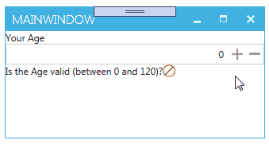

# Example how to bind to a StaticProperty

This App should just give a sample how one could Bind to a `StaticProperty` that updates dynamically. 

In the ViewModel there is a non-static Property `Age`and a static bool `IsAgeValid` that inidcates, if the entered number is a valid `Age`.

